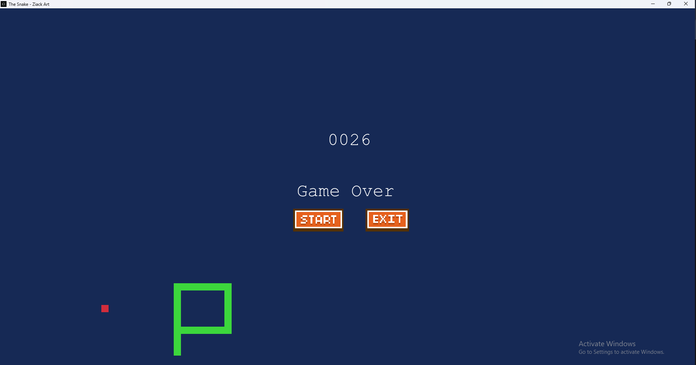
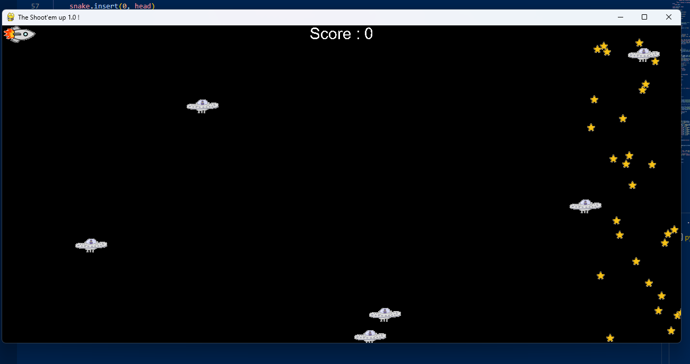

# Python Games Collection

A collection of classic arcade-style games built with Python and Pygame. This project includes two fun games: Snake and Plane Shooter.

## 📋 Table of Contents

- [Project Overview](#project-overview)
- [Games Included](#games-included)
- [Project Structure](#project-structure)
- [Installation](#installation)
- [How to Play](#how-to-play)
- [Game Controls](#game-controls)
- [File Descriptions](#file-descriptions)
- [Dependencies](#dependencies)
- [System Requirements](#system-requirements)

---

## Project Overview

This collection features retro-style games developed in Python using the Pygame library. Each game offers an engaging experience with audio effects, dynamic visuals, and interactive gameplay.

### Key Features:

- 🎮 Two fully functional games
- 🔊 Sound effects for all game actions
- 🖼️ Custom graphics and sprites
- 💾 High score tracking system
- 🎯 Responsive controls
- 📱 Resizable game windows

---

## Games Included

### 1. **Snake Game** 🐍



The classic Snake game where players control a snake to eat food and grow longer while avoiding collisions with walls and itself.

**Features:**

- Progressive difficulty increase
- Score tracking with high score display
- Sound effects for eating, collisions, and milestones
- Resizable game window
- Game Over screen with restart option

**Game Modes:**

- Play the snake and eat food to increase your score
- Difficulty increases every 5 points eaten
- Try to beat the high score!

---

### 2. **Plane Shooter Game** ✈️



An action-packed space shooter where players control a spaceship to destroy enemies and collect bonuses.

**Features:**

- Spaceship control with smooth movement
- Missile firing system
- Enemy sprites with collision detection
- Power-ups and stars for additional points
- Dynamic difficulty scaling
- Explosion effects and sound

**Game Modes:**

- Destroy incoming enemies
- Collect stars for bonus points
- Survive as long as possible
- Reach high scores

---

## Project Structure

```
Python-Games/
│
├── README.md                 # Project documentation
├── plane.png                 # Plane game preview image
├── snake.png                 # Snake game preview image
│
├── Snake-game/
│   ├── Snake.py             # Main Snake game file
│   ├── button.py            # Button class for UI interactions
│   ├── score.txt            # High score storage file
│   │
│   └── asserts/             # Game assets folder
│       ├── icon.jpg         # Game window icon
│       ├── icon.ico         # Alternative icon format
│       ├── start_btn.png    # Start button image
│       ├── exit_btn.png     # Exit button image
│       ├── die.wav          # Death sound effect
│       ├── eat.wav          # Eating sound effect
│       └── point.wav        # Point milestone sound effect
│
└── Plane-game/
    ├── main.py              # Main Plane game file
    ├── vaisseau.png         # Player spaceship sprite
    ├── ennemi.png           # Enemy sprite
    ├── missile.png          # Missile sprite
    ├── etoile.png           # Star/bonus sprite
    ├── explosion.png        # Explosion effect sprite
    ├── laser.ogg            # Laser firing sound
    └── explosion.ogg        # Explosion sound effect
```

---

## Installation

### Prerequisites

Ensure you have Python 3.13 or higher installed on your system.

> **Note:** Python 3.14 is not recommended as Pygame does not have pre-compiled wheels for this version.

### Step 1: Clone or Download

Download this repository to your local machine.

### Step 2: Install Dependencies

Open a terminal in the project root directory and run:

```bash
py -3.13 -m pip install pygame
```

Or if you prefer using the standard python command:

```bash
pip install pygame
```

### Step 3: Verify Installation

Test if Pygame is installed correctly:

```bash
py -3.13 -c "import pygame; print('Pygame installed successfully!')"
```

---

## How to Play

### Running Snake Game

From the project root directory, run:

```bash
py -3.13 Snake-game/Snake.py
```

Or on macOS/Linux:

```bash
python3 Snake-game/Snake.py
```

### Running Plane Shooter Game

From the project root directory, run:

```bash
py -3.13 Plane-game/main.py
```

Or on macOS/Linux:

```bash
python3 Plane-game/main.py
```

---

## Game Controls

### Snake Game 🐍

| Control           | Action                             |
| ----------------- | ---------------------------------- |
| **↑ Up Arrow**    | Move snake up                      |
| **↓ Down Arrow**  | Move snake down                    |
| **← Left Arrow**  | Move snake left                    |
| **→ Right Arrow** | Move snake right                   |
| **ESC**           | Quit game                          |
| **Mouse Click**   | Interact with buttons (Start/Exit) |

**Gameplay Tips:**

- Move towards the red food squares to eat them
- Avoid hitting the walls or yourself
- Each food eaten increases your score by 1
- Difficulty increases every 5 foods eaten (speed increases by 5)
- Try to beat your high score displayed on the screen

---

### Plane Shooter Game ✈️

| Control           | Action               |
| ----------------- | -------------------- |
| **↑ Up Arrow**    | Move spaceship up    |
| **↓ Down Arrow**  | Move spaceship down  |
| **← Left Arrow**  | Move spaceship left  |
| **→ Right Arrow** | Move spaceship right |
| **SPACE**         | Fire missile         |

**Gameplay Tips:**

- Keep moving to avoid enemy fire
- Destroy all enemies that appear
- Collect stars for bonus points
- Your spaceship stays within screen boundaries
- Use rapid firing for better enemy coverage

---

## File Descriptions

### Snake Game Files

#### Snake.py

Main game file containing:

- **Game initialization and window setup** (640x480 pixels, resizable)
- **Core game functions:**
  - `drawFood()` - Renders food on the game board
  - `drawSnake()` - Renders the snake with all its segments
  - `updateSnake()` - Updates snake position and handles collisions
  - `gameOver()` - Displays game over screen with options
  - `score()` - Renders score text on screen
  - `lire_score()` - Reads high score from file
  - `format_score()` - Formats scores with leading zeros
- **Game loop** - Handles events, updates, and rendering

#### button.py

UI Button class providing:

- Button creation with custom images and scaling
- Mouse collision detection
- Click handling and state management
- Used for Start/Exit buttons in game over screen

#### score.txt

Simple text file that stores:

- The highest score achieved in the Snake game
- Automatically updated when current score exceeds high score
- Format: Four-digit number with leading zeros (e.g., "0145")

#### asserts/ (Assets Folder)

Contains all multimedia resources:

**Graphics:**

- `icon.jpg` - Game window icon (jpg format)
- `icon.ico` - Game window icon (ico format)
- `start_btn.png` - Start button for game restart (PNG image)
- `exit_btn.png` - Exit button to close game (PNG image)

**Audio:**

- `die.wav` - Sound effect played when snake collides (collision alert)
- `eat.wav` - Sound effect played when snake eats food (eating sound)
- `point.wav` - Sound effect played every 5 foods eaten (achievement sound)

---

### Plane Game Files

#### main.py

Main game file containing:

- **Screen setup** (1280x600 pixels)
- **Sprite classes:**
  - `Vaisseau` - Player-controlled spaceship
  - `Missile` - Projectiles fired by the player
  - `Ennemi` - Enemy spaceships
  - `Laser` - Enemy fire
- **Game mechanics:**
  - Collision detection
  - Sprite movement and updates
  - Score tracking
  - Enemy spawning system
  - Difficulty progression
- **Game loop** - Event handling, rendering, and physics updates

#### Game Assets (asserts folder)

**Graphics (PNG files):**

- `vaisseau.png` - Player spaceship sprite (40-50px)
- `ennemi.png` - Enemy spaceship sprite
- `missile.png` - Projectile sprite for player missiles
- `etoile.png` - Star/bonus collectible sprite
- `explosion.png` - Explosion animation sprite

**Audio (OGG files):**

- `laser.ogg` - Sound effect for missile firing (shooting sound)
- `explosion.ogg` - Sound effect for enemy destruction (explosion sound)

---

## Dependencies

### Required Libraries

```
pygame==2.6.1
```

### Optional Libraries

For development and troubleshooting:

- Python 3.13+ (recommended for Pygame compatibility)
- pip (Python package manager)

---

## System Requirements

### Minimum Requirements

- **OS:** Windows 7+, macOS 10.10+, or Linux (Ubuntu 18.04+)
- **Python:** 3.13 or higher
- **RAM:** 512 MB minimum
- **Disk Space:** 50 MB for installation and assets
- **Display:** 1024x768 minimum resolution

### Recommended Requirements

- **OS:** Windows 10/11, macOS 11+, or Linux (Ubuntu 20.04+)
- **Python:** 3.13
- **RAM:** 2 GB
- **Disk Space:** 100 MB
- **Display:** 1920x1080 or higher
- **GPU:** Integrated graphics or better

### Troubleshooting Installation

If you encounter SSL certificate errors during Pygame installation:

```bash
# Use Python 3.13 (which has pre-compiled wheels)
py -3.13 -m pip install pygame

# Or specify trusted hosts
py -3.13 -m pip install pygame --trusted-host pypi.org --trusted-host files.pythonhosted.org
```

---

## Game Development Notes

### Architecture

- **Sprite-based rendering** - Efficient graphics using Pygame sprite groups
- **Event-driven gameplay** - Keyboard and mouse input handling
- **Collision detection** - Rectangle-based collision system
- **Frame rate control** - FPS capping for consistent gameplay speed

### Audio Implementation

Both games use Pygame's mixer module for:

- Sound effect loading and playback
- Real-time audio feedback
- Non-blocking sound execution

### Scoring System

**Snake Game:**

- 1 point per food eaten
- Difficulty increases every 5 points
- High score persistence via `score.txt`

**Plane Game:**

- Points for destroying enemies
- Bonus points for collecting stars
- Dynamic score display

---

## Features in Detail

### Snake Game Mechanics

1. **Food Generation** - Random food placement avoiding snake body
2. **Collision Detection** - Wrapping edges and self-collision detection
3. **Progressive Difficulty** - Speed increases in increments of 5
4. **Game State Management** - Play, Game Over, and Restart states
5. **Score Persistence** - Automatic high score saving

### Plane Game Mechanics

1. **Enemy Spawning** - Random enemy generation at screen edges
2. **Missile System** - Single missile per shot with collision detection
3. **Power-ups** - Star collectibles for bonus scoring
4. **Explosion Effects** - Visual and audio feedback for destroys
5. **Screen Wrapping** - Player ship constrained to visible area

---

## Customization Guide

### Modifying Game Difficulty

**Snake Game:**

- Edit starting `diff` variable (default: 10) in Snake.py
- Change `i == 5` condition to adjust difficulty increment frequency

**Plane Game:**

- Modify enemy spawn rate in main.py
- Adjust enemy movement speed
- Change missile damage/cooldown values

### Changing Graphics

Replace PNG/OGG files in the respective `asserts/` folders:

1. Maintain original file names
2. Keep similar dimensions to prevent visual glitches
3. Ensure proper color formats (RGB or RGBA)

### Adjusting Game Window Size

**Snake Game:**

```python
W = 640  # Width in pixels
H = 480  # Height in pixels
```

**Plane Game:**

```python
LARGEUR_ECRAN = 1280  # Width in pixels
HAUTEUR_ECRAN = 600   # Height in pixels
```

---

## Future Enhancement Ideas

- 🎨 Add color themes and customization
- 📊 Leaderboard system for high scores
- 🎮 Difficulty levels selection
- 🔊 Music background track
- ✨ Power-up system enhancements
- 👥 Multiplayer modes
- 📱 Mobile port compatibility
- 🌍 Internationalization (multi-language support)

---

## License

This project is open source and available for educational and personal use.

---

## Author

Created with ❤️ using Python and Pygame

## Disclaimer

These games are provided as-is for educational purposes. Use and modify freely for learning and entertainment.

---

## Support & Troubleshooting

### Common Issues

**Issue:** "ModuleNotFoundError: No module named 'pygame'"

- **Solution:** Reinstall Pygame using `py -3.13 -m pip install pygame`

**Issue:** Images or sounds not loading

- **Solution:** Ensure you're running the game from the correct directory. The `asserts/` folder must be in the same directory as the game Python file.

**Issue:** Game runs slowly

- **Solution:** Close background applications, reduce screen resolution, or update graphics drivers

**Issue:** Window won't resize in Snake game

- **Solution:** Remove RESIZABLE flag from line 7 in Snake.py: `wind = pygame.display.set_mode((W,H))`

---

## Version History

- **v1.0** (2026) - Initial release with Snake and Plane Shooter games

---

**Enjoy playing! 🎮**
